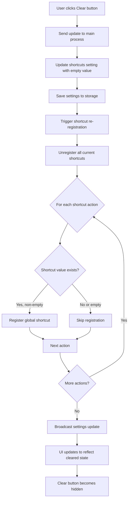
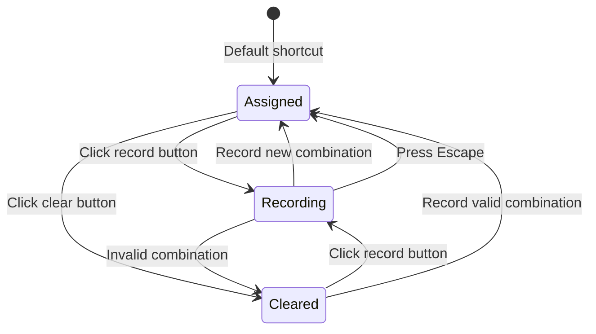

# Feature Design: Add Shortcut Removal Option

## Feature Overview

Enable users to remove or clear keyboard shortcut combinations from the shortcuts settings interface, allowing them to disable specific shortcuts without assigning a replacement key combination.

## Background and Motivation

Currently, the shortcuts configuration interface only allows users to record and assign new keyboard combinations to actions. There is no mechanism to remove or clear a shortcut entirely. Users who want to disable specific shortcuts have no option to do so, which limits customization flexibility.

This feature addresses the need to:
- Disable unwanted shortcuts that might conflict with other applications
- Reduce accidental activation of certain features
- Provide full control over which shortcuts are active

## Feature Requirements

### Functional Requirements

1. Each shortcut entry in the settings UI must provide a mechanism to clear or remove the assigned key combination
2. When a shortcut is cleared, the system must unregister that specific global shortcut
3. Cleared shortcuts must be stored in settings as empty or null values
4. Cleared shortcuts must persist across application restarts
5. Users must be able to re-assign a shortcut after clearing it
6. The UI must clearly indicate when a shortcut is not assigned

### Non-Functional Requirements

1. The removal operation must be intuitive and discoverable
2. The UI change must be minimal and consistent with existing design
3. The feature must work for both global and local shortcuts
4. Must support all existing shortcut actions without exception

## System Design

### User Interface Design

#### Shortcut Setting Item Structure

Each shortcut setting item currently contains:
- Label and description of the action
- Recording button displaying the current key combination
- Optional global/local toggle for advanced users

The updated structure will include:
- Label and description (unchanged)
- Recording button (unchanged)
- **Clear/Remove button** (new) - positioned adjacent to the recording button
- Optional global/local toggle (unchanged)

#### Clear Button Specifications

**Visual Design:**
- Icon-based button using a clear "X" or "trash" icon
- Small, unobtrusive size to avoid cluttering the interface
- Positioned between the recording button and the global/local toggle
- Displays only when a shortcut is currently assigned
- Uses consistent styling with other UI elements

**Interaction Behavior:**
- Single click removes the shortcut immediately
- No confirmation dialog required (low-risk operation)
- Button becomes hidden when no shortcut is assigned
- Visual feedback on hover to indicate interactivity

**Button States:**
- Visible: When shortcut has a value
- Hidden: When shortcut is empty, null, or undefined
- Disabled: Never (always clickable when visible)

#### Empty Shortcut Display

When a shortcut is cleared:
- Recording button displays placeholder text such as "Not assigned" or "Click to record"
- Clear button is hidden
- Global/local toggle remains functional but grayed out
- Different visual styling to distinguish from assigned shortcuts

### Data Model Design

#### Settings Storage Schema

Shortcuts are stored within the settings object structure:

```
settings: {
  shortcuts: {
    showHide: "Command+G" | "" | null,
    quit: "Command+Q" | "" | null,
    screenshot: "Command+Alt+S" | "" | null,
    newChat: "Command+Shift+N" | "" | null,
    // ... other shortcuts
  },
  shortcutsGlobalPerKey: {
    showHide: true,
    screenshot: false,
    // ... per-key global flags
  }
}
```

**Empty Value Convention:**
- Use empty string `""` or `null` to represent cleared shortcuts
- Both values indicate the shortcut is not assigned
- System must handle both cases equivalently

**Backward Compatibility:**
- Existing shortcuts without values default to platform-specific defaults
- Missing properties are handled gracefully without errors

### Shortcut Registration Logic

#### Registration Process Flow

When shortcuts are registered:

1. System retrieves shortcuts configuration from settings
2. All existing global shortcuts are unregistered
3. For each shortcut action in configuration:
   - Check if shortcut value exists and is non-empty
   - If value is valid: Register the global shortcut with Electron's globalShortcut API
   - If value is empty or null: Skip registration for this action
4. Pie menu shortcut receives special handling with try-catch error handling

#### Conditional Registration Logic

The shortcut registration function must implement conditional checks:

**For standard shortcuts:**
- Only register if the shortcut value is truthy and non-empty
- Skip registration silently for empty values
- No error logging required for intentionally cleared shortcuts

**For special shortcuts:**
- showHide shortcut: Check existence before registering
- pieMenu shortcut: Maintain existing try-catch error handling
- Per-key global toggles: Respect when determining registration scope

### Event Handling and State Management

#### Settings Update Flow

When a user clears a shortcut:

1. User clicks the clear button in settings UI
2. Settings UI sends update event to main process
3. Settings module updates the shortcuts object with empty value
4. Settings update triggers shortcut re-registration
5. Main process calls registerShortcuts function
6. Cleared shortcut is not registered during registration cycle
7. Settings update broadcast to all windows and views
8. UI updates to reflect cleared state

#### UI State Synchronization

Settings UI must maintain synchronization:
- Listen for settings-updated events from main process
- Update button visibility based on shortcut values
- Refresh recording button text to show current state
- Update per-key toggle states and visibility

### Integration Points

#### Settings Module Integration

File: `modules/settings.js`
- No structural changes required
- Existing merge logic handles empty shortcut values
- Default settings provide fallback values

#### Shortcuts Registry Integration

File: `modules/features/shortcuts/shortcuts-registry.js`
- Modify registerShortcuts function to check for empty values
- Add conditional registration for all shortcut actions
- Maintain existing shortcut action handlers

#### Settings UI Integration

File: `html/settings.html`
- Add clear button HTML element to each shortcut item
- Implement click handler for clear button
- Add visibility toggle logic based on shortcut value
- Update CSS for button styling and positioning

#### Main Process Integration

File: `main.js`
- No changes required
- Existing IPC handler for setting updates already triggers re-registration
- Shortcut re-registration occurs automatically on settings change

## Workflow Diagram



## State Transition Diagram



## Implementation Considerations

### Settings UI Implementation

**HTML Structure Changes:**
Each shortcut setting item requires a clear button:
- Insert button element between recording button and toggle switch
- Use appropriate icon (close, clear, or trash icon)
- Apply consistent spacing and alignment
- Add data attribute to identify associated shortcut key

**JavaScript Implementation:**
- Query all clear buttons on settings page load
- Attach click event listeners to clear buttons
- Clear button handler sends setting update with empty value
- Update button visibility based on current shortcut values
- Synchronize with settings-updated event from main process

**CSS Styling:**
- Define clear button styles matching existing UI design
- Add hover and active states for visual feedback
- Implement visibility control classes
- Ensure proper spacing in flex layout with other controls

### Registration Logic Implementation

**Core Registration Function:**
The registerShortcuts function must validate each shortcut value before registration:
- Retrieve shortcuts object from settings
- Check each shortcut property for existence and non-empty value
- Use conditional blocks or guard clauses to skip empty shortcuts
- Maintain special handling for pieMenu shortcut with error catching

**Validation Strategy:**
Determine empty state using one of these approaches:
- Check for falsy value (covers null, undefined, empty string)
- Explicit comparison to empty string and null
- Use optional chaining and nullish coalescing for safety

### Edge Cases and Error Handling

#### Edge Case: All Shortcuts Cleared
- System must function normally with zero registered shortcuts
- No errors should occur during registration cycle
- Users can still access settings through UI or menu

#### Edge Case: Clearing Critical Shortcuts
- No restrictions on which shortcuts can be cleared
- Users may clear showHide or quit shortcuts
- Application remains accessible through taskbar, dock, or tray icon

#### Edge Case: Settings Migration
- Older settings files may not have shortcut properties
- System must handle missing properties gracefully
- Default values from settings module provide fallback

#### Error Handling: Registration Failures
- Maintain existing error handling for registration failures
- Distinguish between intentionally cleared and failed registration
- Log errors only for actual failures, not cleared shortcuts

### User Experience Considerations

#### Discoverability
- Clear button must be visually distinct but not overwhelming
- Icon choice should be universally understood
- Tooltip may provide additional context on hover

#### Feedback and Confirmation
- Immediate visual feedback when shortcut is cleared
- No confirmation dialog needed for low-risk operation
- Users can re-assign cleared shortcuts easily

#### Consistency
- Clear button behavior must match user expectations
- Consistent with standard UI patterns for removing items
- Works the same way for all shortcut types

### Accessibility Considerations

- Clear button must be keyboard accessible
- Screen readers must announce button purpose and state
- Focus management must work correctly after clearing
- Sufficient color contrast for button visibility

### Localization Requirements

**Translatable Strings:**
- Clear button label or tooltip text
- "Not assigned" placeholder text for empty shortcuts
- Any help text or descriptions related to clearing

**Translation Keys Required:**
- `clearShortcut-button`: Text for clear button (if using text label)
- `shortcutNotAssigned-placeholder`: Placeholder for empty shortcut state
- `clearShortcut-tooltip`: Tooltip explaining clear functionality

## Testing Scenarios

### Functional Testing Scenarios

| Scenario | Action | Expected Result |
|----------|--------|-----------------|
| Clear assigned shortcut | Click clear button on shortcut with value | Shortcut value becomes empty, button hides, global shortcut unregistered |
| Clear already empty shortcut | Attempt to clear shortcut with no value | Clear button should not be visible |
| Re-assign cleared shortcut | Click record button after clearing, enter combination | New shortcut is assigned and registered |
| Save and restart | Clear shortcut, close app, reopen | Cleared state persists, shortcut remains empty |
| Clear multiple shortcuts | Clear several shortcuts sequentially | Each shortcut is cleared independently |
| Clear all shortcuts | Clear every shortcut in settings | All shortcuts removed, app still functional |
| Clear with global toggle | Clear shortcut with per-key global toggle enabled | Shortcut cleared, toggle state preserved |
| Trigger cleared shortcut | Press key combination of cleared shortcut | No action occurs, shortcut not registered |

### UI Testing Scenarios

| Scenario | Expected Visual Behavior |
|----------|-------------------------|
| Load settings with assigned shortcut | Clear button visible, recording button shows combination |
| Load settings with empty shortcut | Clear button hidden, recording button shows placeholder |
| Click clear button | Button disappears, recording button text changes to placeholder |
| Hover over clear button | Visual feedback indicating clickable state |
| Clear button in advanced mode | Positioning remains correct with global toggle visible |
| Clear button in simple mode | Positioning remains correct without global toggle |

### Integration Testing

- Settings update propagates correctly to main process
- Shortcut re-registration occurs without errors
- Settings broadcast reaches all windows and views
- UI state synchronizes across multiple settings windows
- Per-key global toggles interact correctly with cleared shortcuts

## Success Metrics

### Functionality Metrics
- Users can successfully clear any shortcut
- Cleared shortcuts do not register globally
- Cleared state persists across sessions
- Re-assignment works correctly after clearing

### User Experience Metrics
- Clear operation completes in under 100ms
- Visual feedback is immediate and clear
- No user confusion about cleared state
- Intuitive re-assignment process

## Future Enhancements

### Potential Extensions
- Bulk clear operation for all shortcuts
- Reset to default shortcuts option per action
- Import/export shortcuts configuration
- Shortcut conflict detection and warnings
- Preset shortcut schemes (minimal, standard, power user)

### Advanced Features
- Undo/redo for shortcut changes
- Shortcut usage analytics
- Recommendations for conflicting shortcuts
- Visual keyboard layout showing assigned shortcuts

## Dependencies and Constraints

### Technical Dependencies
- Electron globalShortcut API for registration
- electron-store for settings persistence
- IPC communication between renderer and main process
- Event system for settings updates

### Design Constraints
- Must maintain existing UI visual style
- Cannot break existing shortcut functionality
- Must support both macOS and Windows platforms
- Limited space in settings UI layout

### Platform Considerations
- macOS uses Command key, Windows uses Control/Alt
- Global shortcut availability varies by platform
- System shortcuts may conflict on different platforms
- Platform-specific default shortcuts must be respected
