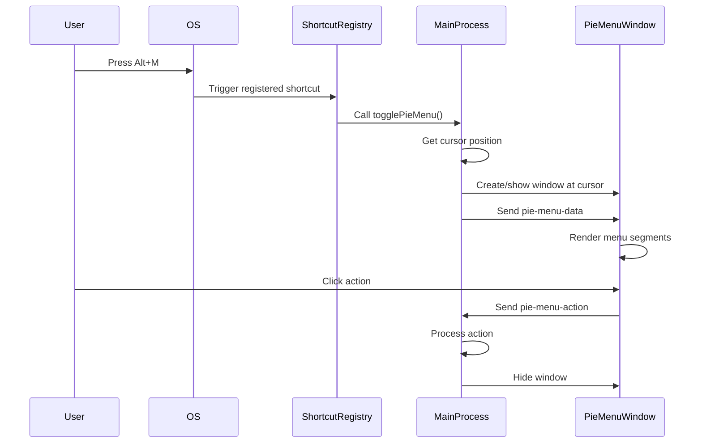

# Pie Menu Not Working - Root Cause Analysis

## Problem Statement

The pie menu feature is not functioning when users attempt to trigger it via keyboard shortcut. While the pie menu implementation exists in the codebase with complete UI components, IPC handlers, and action processing logic, it cannot be activated because the global keyboard shortcut is not being registered.

## Root Cause

The pie menu shortcut registration is missing from the shortcut registration module. Although the default shortcut configuration exists in settings as `Alt+M`, the actual global shortcut registration call is not implemented.

### Evidence

**Settings Configuration (Exists)**
- Location: `modules/settings.js` lines 61-72
- Default shortcut defined: `pieMenu: 'Alt+M'`
- Pie menu actions configured with 8 default actions (flash, thinking, pro, new chat, new window, screenshot, settings, voice)

**UI Implementation (Exists)**
- Pie menu HTML structure: `html/pie-menu.html`
- Pie menu JavaScript logic: `html/js/pie-menu.js`
- Pie menu CSS styling: `html/css/pie-menu.css`
- Settings UI for configuring pie menu: `html/settings.html` lines 883-900 and 1954-1992

**Main Process Implementation (Exists)**
- Pie menu window creation: `main.js` lines 2661-2696
- Toggle function: `main.js` lines 2698-2718
- IPC handler: `main.js` line 2728
- Action processing logic: `main.js` lines 2733-2922

**Preload API Bridge (Exists)**
- Pie menu IPC channels exposed: `preload.js` lines 174-175

**Missing Component**
- Location: `modules/features/shortcuts/shortcuts-registry.js` function `registerShortcuts()`
- Current state: Only registers `showHide` shortcut at line 383-417
- Line 420 contains placeholder comment: "Register other shortcuts from settings ..."
- No actual registration for pie menu shortcut

## Impact Analysis

### Current Behavior
- Pie menu cannot be opened via keyboard shortcut
- Users have no way to access the pie menu functionality
- All pie menu actions (new window with models, screenshot, settings, voice assistant) are inaccessible through this interface

### Affected Functionality
- Quick access to create new windows with specific AI models (Flash, Thinking, Pro)
- Screenshot capture shortcut
- Settings window access
- Voice assistant activation
- Custom prompt injection
- Window minimize/maximize controls

## Technical Context

### Architecture Overview

The pie menu system follows Electron IPC architecture pattern:

**Renderer Process (pie-menu.html)**
- Receives data via `pie-menu-data` IPC channel
- Sends actions via `pie-menu-action` IPC channel
- Dynamically renders menu segments based on enabled actions and custom prompts

**Main Process (main.js)**
- Creates transparent, frameless window centered on cursor
- Sends configuration data on window show
- Processes action requests and routes to appropriate handlers
- Manages window visibility and focus behavior

**Shortcut Registry (shortcuts-registry.js)**
- Responsible for registering all global shortcuts
- Currently incomplete - missing pie menu registration

### Expected Integration Flow



### Current State vs Expected State

| Component | Expected State | Current State | Status |
|-----------|---------------|---------------|---------|
| Settings configuration | Shortcut defined | Shortcut defined (Alt+M) | ✓ Complete |
| Toggle function | Implemented | Implemented (togglePieMenu) | ✓ Complete |
| Window creation | Implemented | Implemented (createPieMenuWindow) | ✓ Complete |
| IPC handlers | Implemented | Implemented (pie-menu-action) | ✓ Complete |
| Action processors | Implemented | Implemented (all actions) | ✓ Complete |
| UI components | Implemented | Implemented (HTML/CSS/JS) | ✓ Complete |
| Preload API | Implemented | Implemented (electronAPI) | ✓ Complete |
| Shortcut registration | Should register | **NOT REGISTERED** | ✗ Missing |

## Solution Design

### Objective

Register the pie menu global keyboard shortcut in the shortcut registry module to enable users to trigger the pie menu via the configured keyboard combination.

### Registration Location

The shortcut registration should be added in `modules/features/shortcuts/shortcuts-registry.js` within the `registerShortcuts()` function, following the existing pattern used for the `showHide` shortcut.

### Registration Logic Requirements

**Shortcut Source**
- Read from: `settings.shortcuts.pieMenu`
- Default value: `Alt+M`
- Should respect user customization from settings

**Handler Invocation**
- Must call the `togglePieMenu()` function defined in `main.js`
- Requires access to main process scope (currently shortcuts-registry is isolated)

**Conditional Registration**
- Only register if shortcut is defined and not empty
- Handle registration failures gracefully
- Support re-registration when settings change

### Architectural Challenge

The shortcuts-registry module is isolated and does not have direct access to the `togglePieMenu()` function in main.js. This presents two design options:

#### Option A: Pass Toggle Function as Dependency
- Initialize shortcuts-registry with togglePieMenu reference
- Store reference during module initialization
- Call stored reference during shortcut handler

**Advantages:**
- Clean separation of concerns
- Registry remains testable and modular
- Follows dependency injection pattern

**Disadvantages:**
- Requires modification to initialization pattern
- Creates coupling through dependency

#### Option B: Move Toggle Logic to Shortcuts Module
- Relocate togglePieMenu function to shortcuts-registry
- Pass window factory methods as dependencies
- Registry manages all shortcut actions consistently

**Advantages:**
- Centralized shortcut action management
- Consistent architecture for all shortcuts
- Easier to maintain and test

**Disadvantages:**
- Requires refactoring existing code
- Pie menu window management scattered across modules

#### Recommended Approach: Option A

Pass togglePieMenu as dependency during initialization to maintain current architecture while enabling quick resolution.

### Implementation Requirements

**Module Initialization**
- Add `togglePieMenu` to dependencies passed to shortcuts-registry
- Store reference in module-level variable
- Pattern: Similar to existing `windowFactory` dependency

**Shortcut Registration**
- Add registration block in `registerShortcuts()` function
- Position: After `showHide` registration block
- Conditional check: Verify shortcut exists before registering
- Error handling: Catch registration failures

**Re-registration Support**
- When settings change, `registerShortcuts()` is already called
- New registration will pick up updated shortcut key
- Existing pattern supports this without modification

### Registration Code Pattern

The implementation should follow this conceptual pattern:

```
IF shortcuts.pieMenu exists and is not empty THEN
  Register global shortcut with key from shortcuts.pieMenu
  When triggered:
    Call togglePieMenu function
  Handle registration errors without crashing
END IF
```

### Integration Points

**Initialization Chain**
- Location: `main.js` app.whenReady() handler around line 1333
- Current: Passes settings, utils, constants, windowFactory, browserViewModule
- Required: Add togglePieMenu to dependency object

**Settings Change Handler**
- Location: `main.js` update-setting IPC handler around line 2411
- Current: Already re-registers shortcuts on settings change
- No modification needed - existing logic will work

**Duplicate Window Creation**
- Issue: Both `main.js` and `window-factory.js` have `createPieMenuWindow()`
- Resolution: Use only the version in `main.js` (lines 2661-2696)
- Cleanup: Remove duplicate from window-factory.js to prevent confusion

## Validation Criteria

### Functional Requirements

**Shortcut Activation**
- User presses configured shortcut (default Alt+M)
- Pie menu window appears at cursor position
- Menu displays enabled actions and custom prompts
- Window auto-hides on blur or Escape key

**Action Execution**
- Clicking menu items triggers correct actions
- Actions execute in appropriate windows
- Menu closes after action selection
- Custom prompts inject text without auto-send

**Settings Integration**
- Shortcut can be customized in settings
- Changes apply after settings save
- Actions can be enabled/disabled
- Custom prompts appear when showInPieMenu is true

### Technical Validation

**Registration Success**
- Global shortcut registers without errors
- Shortcut responds to key press events
- Re-registration works after settings change
- Unregistration occurs on app quit

**Window Behavior**
- Window creates on first trigger
- Window reuses on subsequent triggers
- Window positions correctly at cursor
- Window maintains transparency and frameless style

**Data Flow**
- Settings data flows to pie menu renderer
- Enabled actions filter correctly
- Custom prompts with showInPieMenu flag appear
- IPC communication occurs without errors

## Risk Assessment

**Complexity: Low**
- Single registration call required
- Follows existing pattern
- No new dependencies needed
- Minimal code changes

**Testing Scope: Medium**
- Manual testing across platforms (Windows, macOS, Linux)
- Verify shortcut conflicts don't occur
- Test custom shortcut assignment
- Validate all action types work

**Regression Risk: Low**
- Isolated change to shortcuts module
- No modification to existing shortcuts
- Existing functionality unaffected
- Additive change only

## Related Components

**Files Requiring Modification**
- `modules/features/shortcuts/shortcuts-registry.js` - Add registration
- `main.js` - Pass togglePieMenu dependency

**Files Requiring Review** 
- `modules/window/window-factory.js` - Remove duplicate createPieMenuWindow
- `modules/settings.js` - Verify default shortcut configuration

**No Changes Required**
- `html/pie-menu.html` - UI already complete
- `html/js/pie-menu.js` - Logic already complete
- `html/css/pie-menu.css` - Styling already complete
- `preload.js` - API bridge already complete
- Pie menu action handlers in main.js - Already complete

## Constraints and Considerations

**Shortcut Conflicts**
- Alt+M may conflict with other applications
- Users can customize via settings if needed
- Global shortcut registration may fail if already taken
- Should log warning but not crash on conflict

**Platform Differences**
- Global shortcuts behave differently on Windows/macOS/Linux
- Electron's globalShortcut module handles cross-platform abstraction
- Testing required on all platforms

**Performance**
- Window creation on first trigger adds slight delay
- Subsequent toggles use existing window (fast)
- Data refresh on each show ensures current state
- Acceptable tradeoff for functionality

**User Experience**
- Cursor-centered positioning provides ergonomic access
- Blur-to-hide prevents window staying open accidentally
- Visual feedback on hover improves clarity
- Icon-based actions enhance recognition
