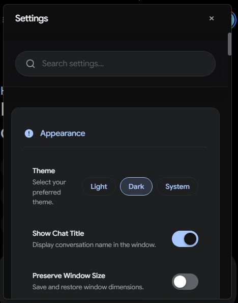
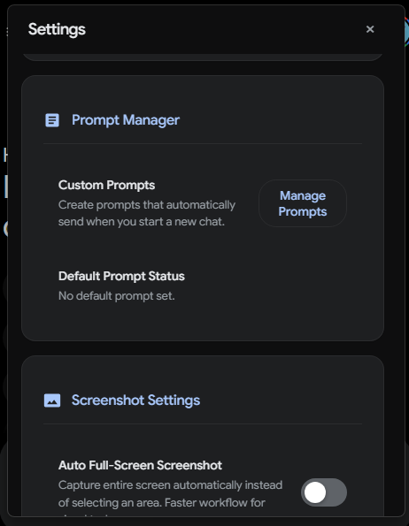
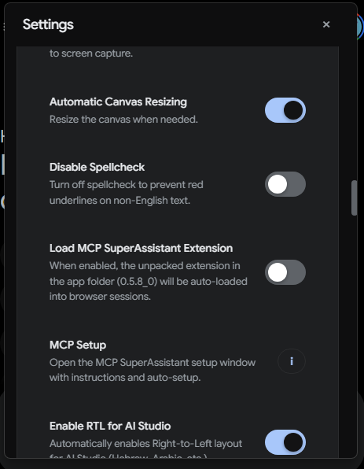
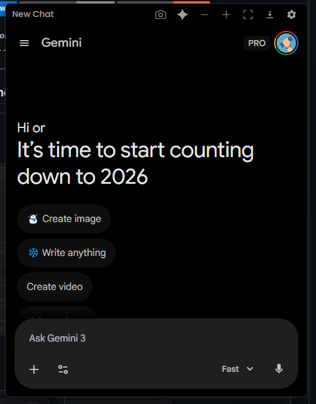
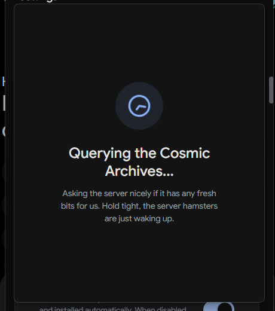

<p align="center">
  
</p>

<h1 align="center">🚀 GeminiDesk - The Unofficial Gemini Desktop Super-App 🚀</h1>

<p align="center">
  <strong>Is Google Gemini just another browser tab in your sea of tabs? We fixed that—and then some.</strong>
  <br />
  GeminiDesk liberates Google's brilliant AI, giving it a permanent, feature-packed home on your desktop. This is the native, supercharged Gemini experience you've been waiting for.
</p>

<p align="center">
    <a href="https://github.com/hillelkingqt/GeminiDesk/releases/latest">
    
  </a>
  <a href="https://github.com/hillelkingqt/GeminiDesk/releases">
    
  </a>
    <a href="https://github.com/hillelkingqt/GeminiDesk/issues">
    
  </a>
  
  
</p>

<p align="center">
  <em>GeminiDesk transforms your AI interaction from a clumsy browser dance into a native desktop symphony. No more clutter. No more distractions. Just pure, unadulterated productivity with a sprinkle of magic.</em>
</p>

---

## ✨ Why Settle for a Tab When You Can Have a Throne? ✨

<table>
  <tr>
    <td align="center"></td>
    <td align="center"></td>
  </tr>
  <tr>
    <td align="center"></td>
    <td align="center"></td>
  </tr>
  <tr>
    <td align="center"></td>
    <td align="center"></td>
  </tr>
  <tr>
    <td align="center"></td>
    <td align="center"></td>
  </tr>
  <tr>
    <td align="center"></td>
    <td align="center"></td>
  </tr>
  <tr>
    <td align="center"></td>
    <td align="center"></td>
  </tr>
</table>


GeminiDesk is more than a wrapper. It's a command center, loaded with powerful, exclusive features that will make you wonder how you ever lived without them.

*   **🔌 Model Context Protocol (MCP) Support: The Power of Connection**
    Connect your AI to your local world. Run local tools, access files, and build powerful workflows with built-in MCP support. The app includes an easy "Do it for me" setup to get your local proxy server running in seconds.

*   **🤖 Your Choice of Playground: Gemini or AI Studio**
    Start your session your way. Choose between the classic **Gemini** chat interface for streamlined conversations or the powerful **AI Studio** for advanced prompt engineering and development.

*   **🗓️ Deep Research Automation & Scheduler: Your AI Autopilot**
    Set it and forget it. Schedule complex research tasks to run automatically! Set a day, time, and a detailed prompt. GeminiDesk will wake up, launch, switch to the Pro model, execute your "Deep Research" query, export the results to Google Docs, and notify you when done—all without you lifting a finger.

*   **📤 Ultimate Export Suite: PDF, Markdown, & Math**
    Your data, your format.
    *   **PDF:** Beautifully formatted with **KaTeX** for perfect math rendering, **Highlight.js** for code syntax highlighting, and full **RTL (Right-to-Left)** support for Hebrew/Arabic.
        [📄 View a sample PDF exported by GeminiDesk](https://github.com/hillelkingqt/GeminiDesk/blob/main/Demonstrating%20Text%20Formatting%20Capabilities.pdf)
    *   **Markdown:** Direct export to `.md` files for your notes or documentation.

*   **📸 Screenshot to Chat: See It, Snip It, Solve It!**
    Instantly snip any part of your screen with a hotkey (`Ctrl+Alt+S`). The image is magically beamed into your chat, ready for Gemini's brilliant analysis.

*   **📋 Clipboard Magic**
    Paste image files, PDFs, or text files directly from your system clipboard into the chat. No more drag-and-drop dances—it just works.

*   **💡 Share Your Ideas**
    Have a feature request? Send it directly to the developer through the built-in "Share Ideas" form. We're listening!

*   **⚡️ Instant Model Switching: Flash or Pro? Decide in a Flash.**
    Why click through menus? Use dedicated hotkeys (`Alt+F`, `Alt+P`) to instantly fire up a new chat with either the lightning-fast **Flash** model or the powerhouse **Pro** model. Your workflow just got a nitrous boost.

*   **🔊 Smart Audio Feedback: Never Miss a Beat**
    Know the second your AI has finished its thought. GeminiDesk detects when the response is complete and plays a subtle, satisfying sound so you can multitask without losing your flow.

*   **🌍 Speak Your Language: Full Internationalization**
    The entire app interface, from tooltips to the settings menu, is fully localized into over 20 languages.

*   **🖼️ Smart Canvas Mode**
    Need more space for a complex thought? The app window automatically expands to a larger, more comfortable "Canvas" size when Gemini enters its immersive panel, perfect for deep dives.

*   **📌 Always-On-Top & System Tray**
    Keep Gemini watching over your shoulder (in a non-creepy way) while you work. Minimize it to the system tray to keep your taskbar clean, but keep it ready at a moment's notice.

*   **🧠 The Little Things That Matter**
    We've ironed out all the wrinkles. **Persistent Login** (sign in once!), **Automatic Mic Permissions**, a **Smart Draggable Header** that shows your current chat title, and **Non-Intrusive Auto-Updates**. It just works.

---

## ⌨️ The Secret Handshakes (Default Shortcuts)

Access the magic from anywhere in your OS. (Remember, you can change ALL of these in the settings!)

| Shortcut                      | Action                                      |
| ----------------------------- | ------------------------------------------- |
| `Alt` + `G`                   | Toggle App Visibility (Show / Hide)         |
| `Alt` + `N`                   | **Open a New Window**                       |
| `Alt` + `Shift` + `N`         | Open a New Chat (Standard)                  |
| `Alt` + `S`                   | **Search Chat History** Instantly           |
| `Ctrl` + `F`                  | **Find in Current Page** (Local Shortcut)   |
| `Ctrl` + `Alt` + `S`          | **Capture Screenshot** & Paste into Chat    |
| `Alt` + `P`                   | Switch to **Pro** Model                     |
| `Alt` + `F`                   | Switch to **Flash** Model                   |
| `Alt` + `Shift` + `P`         | New Chat with **Pro** Model                 |
| `Alt` + `Shift` + `F`         | New Chat with **Flash** Model               |
| `Alt` + `Shift` + `A`         | Activate **Voice Assistant**                |
| `Alt` + `R`                   | **Refresh the active View**                 |
| `Alt` + `Q`                   | Close the Current Window                    |
| `Alt` + `I`                   | Show Instructions / Onboarding Screen       |
| `Command` + `Q` / `Ctrl` + `W` | Quit Application (The "I'm Done" Button)    |

*On macOS, `Alt` is generally replaced by `Command` (e.g., `Command+G`), and `Ctrl` by `Control`.*

---

## 💾 Installation

Getting this slab of awesome onto your machine is laughably simple.

1.  Brave the digital seas and navigate to the [**Latest Release**](https://github.com/hillelkingqt/GeminiDesk/releases/latest) page.
2.  Download the correct installer for your operating system (`.exe` for Windows, `.dmg` for macOS).
3.  Run the installer and follow the on-screen prompts. Click 'Next' like you mean it.

That's it! GeminiDesk is now ready for action.

---

### ⚠️ A Note for macOS Heroes ⚠️

Due to Apple's Gatekeeper security, apps not signed with a pricey Apple Developer ID get marked as "quarantined" when downloaded. This can cause a scary (but false) error message: “GeminiDesk is damaged and can’t be opened.”

**Fear not! Here’s the simple spell to fix it:**

1.  After installing, **do not launch the app yet**.
2.  Open your `Terminal` app (you can find it via Spotlight search).
3.  Paste and run this command. It removes the quarantine flag, telling macOS to trust the app:
    ```sh
    xattr -dr com.apple.quarantine /Applications/GeminiDesk.app
    ```
4.  Now, launch the app normally from Launchpad or your Applications folder.

This one-time step is all it takes to get the best Gemini desktop app running smoothly on your Mac.

---

## 🛠️ For Developers: Building From the Ashes

Want to peek under the hood or forge your own version? We admire your courage.

### Prerequisites
* [Node.js](https://nodejs.org/) (v16 or higher is a good life choice)
* [Git](https://git-scm.com/)

### Get Started

1.  **Clone the legend:**
    ```sh
    git clone https://github.com/hillelkingqt/GeminiDesk.git
    cd GeminiDesk
    ```

2.  **Install the ancient runes (dependencies):**
    ```sh
    npm install
    ```

3.  **Unleash the beast (run in dev mode):**
    ```sh
    npm start
    ```

4.  **Package it for the masses (build the installer):**
    The final artifact will be forged in the `dist/` directory.
    ```sh
    npm run build
    ```

---

## 🤝 Let's Build a Dynasty

Contributions are the lifeblood of open source. If you have an idea that's so good it's scary, we want to see it.

1.  Fork the Project
2.  Create your Feature Branch (`git checkout -b feature/MindBlowingFeature`)
3.  Commit your Changes (`git commit -m 'Add some MindBlowingFeature'`)
4.  Push to the Branch (`git push origin feature/MindBlowingFeature`)
5.  Open a Pull Request and prepare for glory.

---

## 📜 License

This project is distributed under the MIT License, which basically means you can do whatever you want with it as long as you give us a little nod. See the full legal mumbo-jumbo in the [LICENSE](LICENSE) file.
