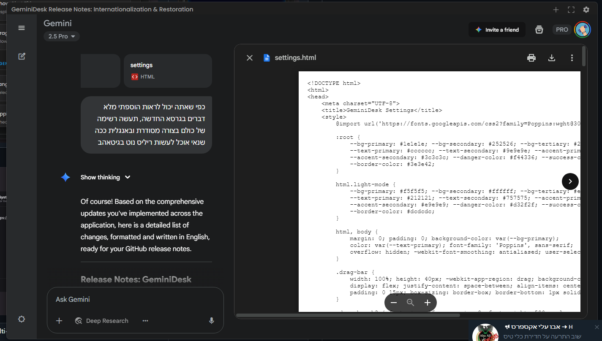
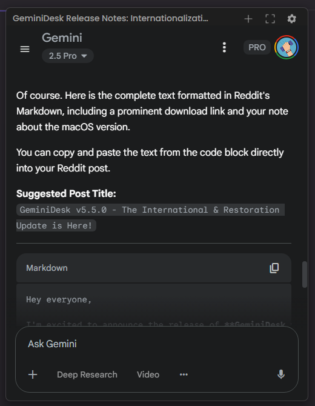
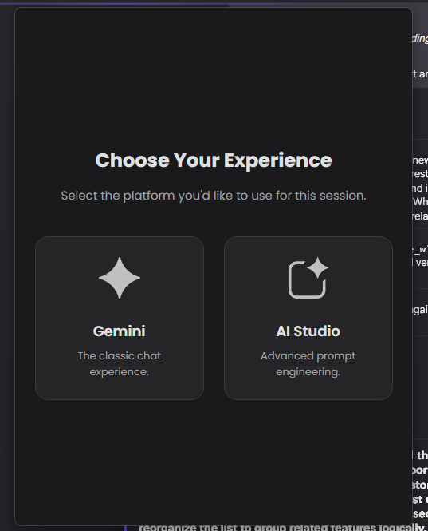
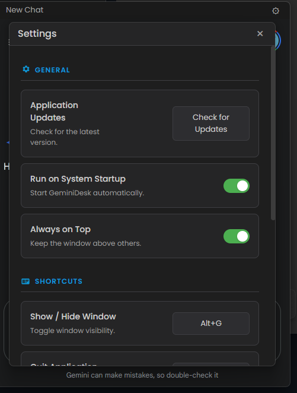

<p align="center">
  
</p>

<h1 align="center">🚀 GeminiDesk - The Unofficial Gemini Desktop Super-App 🚀</h1>

<p align="center">
  <strong>Is Google Gemini just another browser tab in your sea of tabs? We fixed that—and then some.</strong>
  <br />
  GeminiDesk liberates Google's brilliant AI, giving it a permanent, feature-packed home on your desktop. This is the native, supercharged Gemini experience you've been waiting for.
</p>

<p align="center">
    <a href="https://github.com/hillelkingqt/GeminiDesk/releases/latest">
    
  </a>
  <a href="https://github.com/hillelkingqt/GeminiDesk/releases">
    
  </a>
    <a href="https://github.com/hillelkingqt/GeminiDesk/issues">
    
  </a>
  
  
</p>

<p align="center">
  <em>GeminiDesk transforms your AI interaction from a clumsy browser dance into a native desktop symphony. No more clutter. No more distractions. Just pure, unadulterated productivity with a sprinkle of magic.</em>
</p>

---

## ✨ Why Settle for a Tab When You Can Have a Throne? ✨

<table>
  <tr>
    <td align="center"></td>
    <td align="center"></td>
  </tr>
  <tr>
    <td align="center"></td>
    <td align="center"></td>
  </tr>
  <tr>
    <td align="center"></td>
    <td align="center"></td>
  </tr>
  <tr>
    <td align="center"></td>
    <td align="center"></td>
  </tr>
</table>

GeminiDesk is more than a wrapper. It's a command center, loaded with powerful, exclusive features that will make you wonder how you ever lived without them.

*   **🤖 Your Choice of Playground: Gemini or AI Studio**
    Start your session your way. Choose between the classic **Gemini** chat interface for streamlined conversations or the powerful **AI Studio** for advanced prompt engineering and development.

*   **🗓️ Deep Research Automation: Your AI Autopilot**
    Schedule complex research tasks to run automatically! Set a day, time, and a detailed prompt. GeminiDesk will launch, switch to the Pro model and execute your "Deep Research" query, all without you lifting a finger.

*   **📄 Flawless PDF Export: Your Chats, Perfected**
    Export your conversations into beautifully formatted PDF documents. With full support for **Right-to-Left (RTL)** languages like Hebrew and Arabic, and perfect rendering of **KaTeX math equations**, your chats have never looked better on paper.

*   **📸 Screenshot to Chat: See It, Snip It, Solve It!**
    Instantly snip any part of your screen with a hotkey. The image is magically beamed into your chat, ready for Gemini's brilliant analysis. It's like having a conversation with your screen!

*   **⚡️ Instant Model Switching: Flash or Pro? Decide in a Flash.**
    Why click through menus? Use dedicated hotkeys (`Alt+F`, `Alt+P`) to instantly fire up a new chat with either the lightning-fast **Flash** model or the powerhouse **Pro** model. Your workflow just got a nitrous boost.

*   **🔊 Audio Feedback: Never Miss a Beat**
    Know the second your AI has finished its thought. GeminiDesk plays a subtle, satisfying sound the moment the response is complete, so you can look away and multitask without losing your place.

*   **🌍 Speak Your Language: Full Internationalization**
    The entire app interface, from tooltips to the settings menu, is available in multiple languages. Select your preferred language for a truly native experience.

*   **🔧 Your Cockpit, Your Rules: Customizable Toolbar**
    Take control of your workspace. **Drag and drop** the toolbar buttons to reorder them exactly as you like. Don't need a button? Simply hide it in the settings.

*   **🔎 Find Anything, Instantly**
    Lost a brilliant idea in the chat abyss? Hit `Alt+S` to immediately focus the chat history search bar. Need to find text within the current conversation? `Ctrl+F` brings up a sleek, in-page find bar.

*   **✨ Multi-Window Mania**
    Who said you can only have one conversation at a time? Open multiple windows and conquer multiple topics simultaneously. It’s organized chaos at its finest.

*   **🎨 Your App, Your Style: Full Theme Control**
    Choose between a sleek **Dark** mode, a clean **Light** mode, or let the app **sync with your OS**. Your eyes will thank you.

*   **🖼️ Expand Your Mind with Canvas Mode**
    Need more space for a complex thought? The app window automatically expands to a larger, more comfortable "Canvas" size when Gemini enters its immersive panel, perfect for deep dives.

*   **📌 Always-On-Top Mode: Your Unwavering AI Companion**
    Keep Gemini watching over your shoulder (in a non-creepy way) while you work. Perfect for coding, writing, or just feeling less alone.

*   **⌨️ Your Keys, Your Kingdom: Total Shortcut Customization**
    Don't like our default hotkeys? No problem! Dive into the settings and remap every single shortcut to fit your unique workflow.

*   **🚀 Run on Startup & Restore Session**
    Have GeminiDesk greet you the moment your computer boots up. You can also enable "Restore Windows" to have all your previous chat windows reopen exactly where you left them.

*   **🧠 The Little Things That Matter**
    We've ironed out all the wrinkles. **Persistent Login** (sign in once!), **Automatic Mic Permissions**, a **Smart Draggable Header** that shows your current chat title, and **Non-Intrusive Updates**. It just works.

---

## ⌨️ The Secret Handshakes (Default Shortcuts)

Access the magic from anywhere in your OS. (Remember, you can change ALL of these in the settings!)

| Shortcut                      | Action                                      |
| ----------------------------- | ------------------------------------------- |
| `Alt` + `G`                   | Toggle App Visibility (Show / Hide)         |
| `Alt` + `N`                   | **Open a New Window**                       |
| `Alt` + `S`                   | **Search Chat History** Instantly           |
| `Ctrl` + `F`                  | **Find in Current Page** (Local Shortcut)   |
| `Ctrl` + `Alt` + `S`          | **Capture Screenshot** & Paste into Chat    |
| `Alt` + `P`                   | New Chat with **Pro** Model                 |
| `Alt` + `F`                   | New Chat with **Flash** Model               |
| `Alt` + `R`                   | **Refresh the active View**                 |
| `Alt` + `Q`                   | Close the Current Window                    |
| `Alt` + `I`                   | Show Instructions / Onboarding Screen       |
| `Command` + `Q` / `Ctrl` + `W` | Quit Application (The "I'm Done" Button)    |

*On macOS, `Alt` is generally replaced by `Command` (e.g., `Command+G`), and `Ctrl` by `Control`.*

---

## 💾 Installation

Getting this slab of awesome onto your machine is laughably simple.

1.  Brave the digital seas and navigate to the [**Latest Release**](https://github.com/hillelkingqt/GeminiDesk/releases/latest) page.
2.  Download the correct installer for your operating system (`.exe` for Windows, `.dmg` for macOS).
3.  Run the installer and follow the on-screen prompts. Click 'Next' like you mean it.

That's it! GeminiDesk is now ready for action.

---

### ⚠️ A Note for macOS Heroes ⚠️

Due to Apple's Gatekeeper security, apps not signed with a pricey Apple Developer ID get marked as "quarantined" when downloaded. This can cause a scary (but false) error message: “GeminiDesk is damaged and can’t be opened.”

**Fear not! Here’s the simple spell to fix it:**

1.  After installing, **do not launch the app yet**.
2.  Open your `Terminal` app (you can find it via Spotlight search).
3.  Paste and run this command. It removes the quarantine flag, telling macOS to trust the app:
    ```sh
    xattr -dr com.apple.quarantine /Applications/GeminiDesk.app
    ```
4.  Now, launch the app normally from Launchpad or your Applications folder.

This one-time step is all it takes to get the best Gemini desktop app running smoothly on your Mac.

---

## 🛠️ For Developers: Building From the Ashes

Want to peek under the hood or forge your own version? We admire your courage.

### Prerequisites
* [Node.js](https://nodejs.org/) (v16 or higher is a good life choice)
* [Git](https://git-scm.com/)

### Get Started

1.  **Clone the legend:**
    ```sh
    git clone https://github.com/hillelkingqt/GeminiDesk.git
    cd GeminiDesk
    ```

2.  **Install the ancient runes (dependencies):**
    ```sh
    npm install
    ```

3.  **Unleash the beast (run in dev mode):**
    ```sh
    npm start
    ```

4.  **Package it for the masses (build the installer):**
    The final artifact will be forged in the `dist/` directory.
    ```sh
    npm run build
    ```

---

## 🤝 Let's Build a Dynasty

Contributions are the lifeblood of open source. If you have an idea that's so good it's scary, we want to see it.

1.  Fork the Project
2.  Create your Feature Branch (`git checkout -b feature/MindBlowingFeature`)
3.  Commit your Changes (`git commit -m 'Add some MindBlowingFeature'`)
4.  Push to the Branch (`git push origin feature/MindBlowingFeature`)
5.  Open a Pull Request and prepare for glory.

---

## 📜 License

This project is distributed under the MIT License, which basically means you can do whatever you want with it as long as you give us a little nod. See the full legal mumbo-jumbo in the [LICENSE](LICENSE) file.
